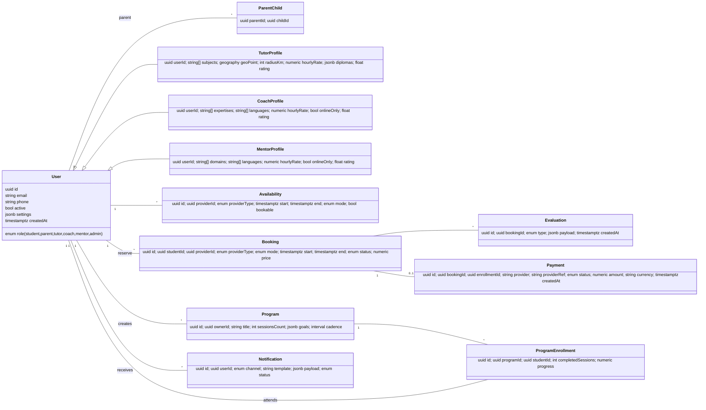
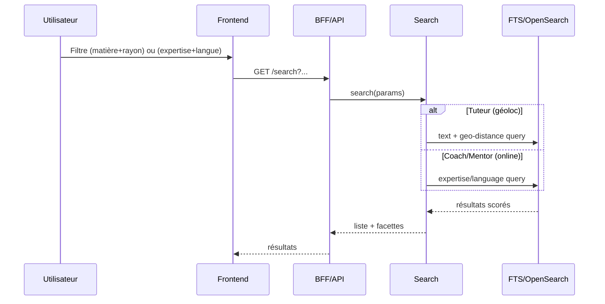
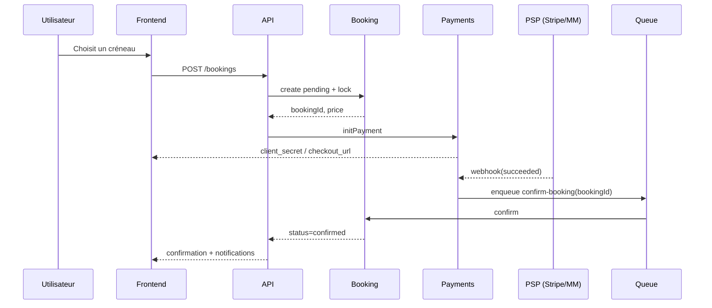
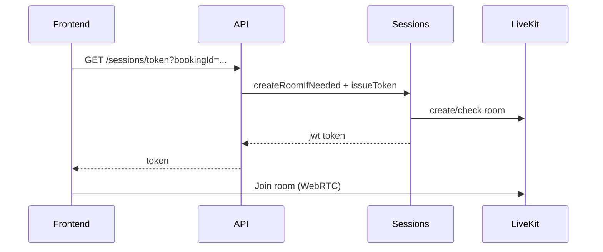
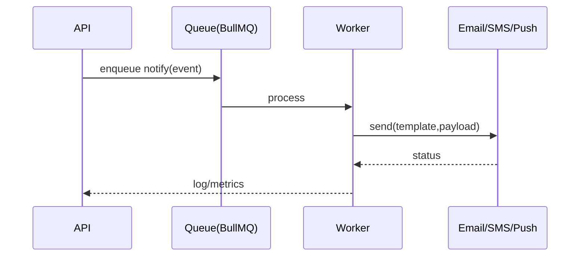
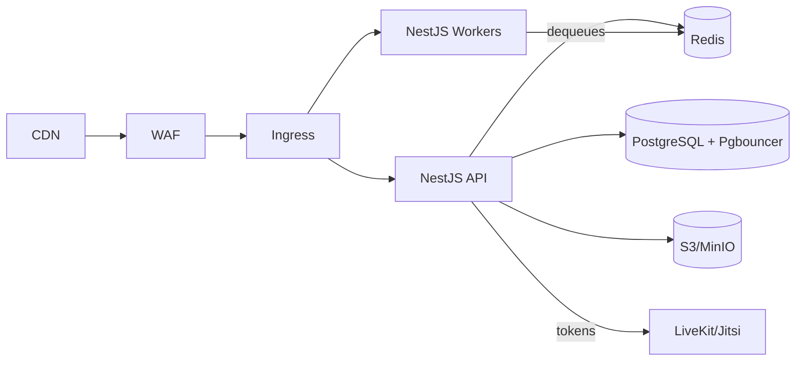

# Document d’Architecture — Plateforme Tuteurs / Coaching / Mentorat (NestJS Haute Perf)

> **But** : Plateforme unifiée pour mise en relation (tuteurs, coachs, mentors), réservation & paiement (carte + Mobile Money), classes virtuelles (LiveKit/Jitsi), évaluations & suivi, notifications multicanales. Web + Mobile.
> **Stack** : **NestJS + Fastify**, **PostgreSQL**, **Redis**, **S3/MinIO**, **LiveKit/Jitsi**, **Stripe + Mobile Money**.
> **Objectifs non-fonctionnels (MVP)** : P95 API < **200 ms**, disponibilité **99.9%**, budget infra < **1500 \$/mois**.

---

## 0. Hypothèses & Contraintes

* **Cloud managé** : AWS (équivalents GCP/Azure possibles).
* **Charge cible MVP** : 5–10k MAU, 500–800 DAU, 100–200 sessions vidéo simultanées.
* **Internationalisation** : FR/EN, faible conso data (optimisation vidéo & images).
* **Paiements** : Stripe (carte), agrégateur Mobile Money (OM/MTN/Moov).
* **Sécurité** : RGPD-like, 2FA/OTP, chiffrement au repos et en transit.

---

## 1. Vue d’ensemble (Composants)

```mermaid
graph LR
  subgraph Clients
    M[Mobile (React Native)]
    W[Web (Next.js)]
  end
  M-->CDN
  W-->CDN

  subgraph Edge
    CDN[CDN/Edge Cache]
    WAF[WAF/RateLimit]
    G[BFF/API (NestJS Fastify)]
  end
  CDN-->WAF-->G

  subgraph Domain Services (Nest)
    AUTH[Auth & RBAC]
    PROF[Profils & KYC]
    SRCH[Recherche & Matching]
    AVAIL[Disponibilités]
    BOOK[Réservations]
    SESS[Sessions & Visioconf]
    EVAL[Évaluations & Suivi]
    PAY[Paiements & Facturation]
    NOTIF[Notifications]
    ADMIN[Admin/Backoffice]
    ANA[Analytics]
  end

  G-->AUTH
  G-->PROF
  G-->SRCH
  G-->AVAIL
  G-->BOOK
  G-->SESS
  G-->EVAL
  G-->PAY
  G-->NOTIF
  G-->ADMIN
  G-->ANA

  subgraph Data
    PG[(PostgreSQL)]
    RE[(Redis)]
    S3[(S3/MinIO)]
    OS[(OpenSearch*)]
    Q[(Queues BullMQ/Redis)]
  end
  AUTH-->PG
  PROF-->PG
  SRCH-->PG
  SRCH-->OS
  AVAIL-->PG
  BOOK-->PG
  EVAL-->PG
  PAY-->PG
  NOTIF-->PG
  NOTIF-->Q
  SESS-->PG
  ANA-->PG
  G-->RE

  subgraph Externes
    MAP[Maps/Geocode]
    RTC[LiveKit/Jitsi]
    PSP[Stripe & Mobile Money]
    MSG[FCM/Brevo/Twilio]
    IDV[KYC Provider]
  end
  SRCH-.geocode.->MAP
  SESS-.rooms/tokens.->RTC
  PAY-.webhooks.->PSP
  NOTIF-.envoi.->MSG
  PROF-.vérif identité.->IDV
```

\* OpenSearch activé en V1+ quand l’index & la recherche deviennent critiques.

---

## 2. Modules Applicatifs (Bounded Contexts NestJS)

* **auth** : OIDC/JWT courts + refresh, OTP (email/SMS), RBAC/ABAC (guards), audit logs.
* **profiles** : utilisateurs (élève, parent, tuteur, coach, mentor, admin), pièces KYC.
* **search** :

  * **Tuteurs** : matière + **géoloc** + tarif + rating + dispo.
  * **Coach/Mentor** : **expertise/langue/objectifs** (sans géoloc).
  * FTS Postgres (MVP) → OpenSearch (V1+).
* **availability** : créneaux, règles d’annulation/no-show, fuseaux horaires.
* **booking** : réservation (pending/confirmed/canceled/refunded), verrous distribués Redis, idempotence.
* **sessions** : intégration LiveKit/Jitsi (création de rooms, tokens, présence, replays), liens sécurisés.
* **evaluations** : quiz (QCM), feedbacks qualitatifs, milestones programmes coach/mentor.
* **payments** : Stripe + Mobile Money (abstraction `PaymentProvider`), webhooks idempotents, réconciliations, payouts.
* **notifications** : email/SMS/push/in-app via BullMQ, modèles multi-langue, préférences.
* **admin** : backoffice (KYC, litiges, pricing, CMS léger), journalisation.
* **analytics** : événements produits (réservations, paiements, no-show, satisfaction), exports.

---

## 3. Modèle de Données (ERD)



> **Index clés** : `(providerId,start,end,status)`, trigram/tsvector sur profils, GIN sur jsonb, PostGIS pour `geoPoint` (si calcul distance SQL).

---

## 4. Flux Métier (Séquences Clés)

### 4.1 Recherche & sélection



### 4.2 Réservation & Paiement



### 4.3 Session en ligne (LiveKit)



### 4.4 Notifications (asynchrone)



---

## 5. Convention d’API (extraits)

* Base : `/api/v1` ; JSON ; **idempotency-key** sur POST sensibles.
* Auth : OAuth2/OIDC (optionnel) + JWT courts (15m) + refresh (7–30j), 2FA/OTP.

```yaml
openapi: 3.0.3
info: { title: EduConnect API, version: 1.0.0 }
paths:
  /search/tutors:
    get:
      parameters: [{ name: subject, in: query }, { name: radiusKm, in: query }, { name: lat, in: query }, { name: lng, in: query }]
      responses: { '200': { description: ok }}
  /search/coaches:
    get:
      parameters: [{ name: expertise, in: query }, { name: lang, in: query }]
      responses: { '200': { description: ok }}
  /bookings:
    post:
      headers: { Idempotency-Key: { schema: { type: string }}}
      requestBody: { required: true }
      responses: { '201': { description: created }}
  /payments/intent:
    post: { responses: { '201': { description: created }}}
  /payments/webhooks:
    post: { responses: { '200': { description: received }}}
  /sessions/token:
    get: { responses: { '200': { description: ok }}}
```

---

## 6. CI/CD & Environnements

* **Branches** : trunk-based (main), feature branches.
* **Pipeline** : lint → tests → build → images → migrations → déploiement (Helm).
* **Envs** : `dev` (compose), `staging` (k8s + données fictives), `prod` (k8s managé).
* **Stratégie** : blue/green ou canary, rollback auto.

**Étapes clés CI**

1. `npm run lint && npm run test`
2. Build Docker multi-stage (NestJS)
3. Push image signée (Cosign)
4. Migrations `typeorm migration:run`
5. `helm upgrade --install` (values par env)
6. Tests fumée post-deploy

---

## 7. Déploiement (Kubernetes)



**K8s** : HPA (CPU 65%/latence), PDB, anti-affinity, requests/limits, secrets (SSM/Vault), configmaps.

---

## 8. Sécurité & Conformité

* **AuthN** : JWT courts + refresh, 2FA/OTP (SMS/email), rotation clés.
* **AuthZ** : RBAC/ABAC via Guards, policies centralisées.
* **Transport** : TLS 1.2+, HSTS, CSP stricte, cookies `HttpOnly/SameSite`.
* **Données** : chiffrement at-rest (PG, S3), masquage PII en logs, rétention par type.
* **KYC** : stockage minimal et chiffré, accès restreint, audit complet.

---

## 9. Observabilité & SLO/SLA

* **Logs** : Pino JSON → OpenSearch/ELK.
* **Metrics** : Prometheus/Grafana (API latency, QPS, erreurs, jobs, webhooks, RTC join time).
* **Traces** : OpenTelemetry (propagation context), sampling 10–20%.

| Domaine           | SLO (MVP)    |
| ----------------- | ------------ |
| API recherche     | P95 < 200 ms |
| Création booking  | P95 < 150 ms |
| Webhooks paiement | P99 < 500 ms |
| Token LiveKit     | P95 < 120 ms |
| Uptime global     | ≥ 99.9%      |

---

## 10. Performance & Scale Patterns

* **Fastify** + schémas (sérialisation rapide) ; **Undici** pour HTTP sortant.
* **Redis** : cache (TTL court), rate-limit, **verrous** (réservation), **BullMQ** (jobs).
* **DB** : index + EXPLAIN ; **Pgbouncer** ; replicas pour lectures.
* **Recherche** : FTS Postgres → **OpenSearch** (distance, score, facettes).
* **RTC** : SFU managé (LiveKit/Jitsi), enregistrements asynchrones vers S3.
* **Outbox** : fiabiliser événements post-transaction.

---

## 11. Docker Compose (Dev)

```yaml
version: "3.9"
services:
  postgres:
    image: postgres:16
    environment:
      POSTGRES_PASSWORD: dev
      POSTGRES_USER: dev
      POSTGRES_DB: edu
    ports: ["5432:5432"]
    volumes: ["pgdata:/var/lib/postgresql/data"]
  redis:
    image: redis:7
    ports: ["6379:6379"]
  minio:
    image: minio/minio:RELEASE.2025-01-11T00-00-00Z
    command: server /data
    environment:
      MINIO_ROOT_USER: dev
      MINIO_ROOT_PASSWORD: devdev123
    ports: ["9000:9000", "9001:9001"]
    volumes: ["minio:/data"]
  mailhog:
    image: mailhog/mailhog
    ports: ["8025:8025", "1025:1025"]
  api:
    build: ./backend
    env_file: .env.development
    depends_on: [postgres, redis, minio]
    ports: ["8080:8080"]
  worker:
    build: ./backend
    command: npm run start:worker
    env_file: .env.development
    depends_on: [redis, postgres]
volumes:
  pgdata: {}
  minio: {}
```

> LiveKit/Jitsi : utiliser l’offre managée en dev, ou un conteneur local si nécessaire (optionnel, lourd).

---

## 12. Roadmap MVP → Scale (sprints 2 semaines)

* **S0 (cadrage)** : personas, parcours, pricing, maquettes Figma, conventions code, CI de base.
* **S1** : Auth/RBAC/OTP, profils & KYC, recherche (tuteurs géoloc / coach/mentor expertise).
* **S2** : Disponibilités, réservation (locks, statuts), notifications basiques.
* **S3** : Paiements (Stripe + 1 Mobile Money), webhooks idempotents, reçus.
* **S4** : Visioconf (LiveKit tokens), programmes coaching/mentorat, suivi parental.
* **S5** : Évaluations (quiz/feedback), exports PDF, préférences notifs.
* **S6** : Backoffice admin, analytics V1, tests de charge & hardening → **GoLive MVP**.
* **V1+** : OpenSearch, read replicas PG, LiveKit dédié, workers notifs/paiements plus robustes, AB tests.

---

## 13. Risques & Parades

| Risque                     | Impact          | Parade                                              |
| -------------------------- | --------------- | --------------------------------------------------- |
| Qualité réseau (visioconf) | cours dégradés  | fallback audio, adaptation bitrate, monitoring MOS  |
| Fraude/chargebacks         | pertes          | KYC, holds, scoring risque, réconciliations solides |
| Coût SMS/email             | marge           | privilégier push/Email, batch/digest, templates     |
| Contention sur créneaux    | no-show/doubles | verrous Redis, idempotence, politiques d’annulation |
| Charge recherche           | lenteurs        | cache + OpenSearch, facettes, pagination stricte    |

---

## 14. Glossaire (rapide)

* **BFF** : Backend For Frontend.
* **SFU** : Selective Forwarding Unit (RTC).
* **FTS** : Full Text Search.
* **SLO** : Service Level Objective.
* **P95/P99** : percentiles de latence.
